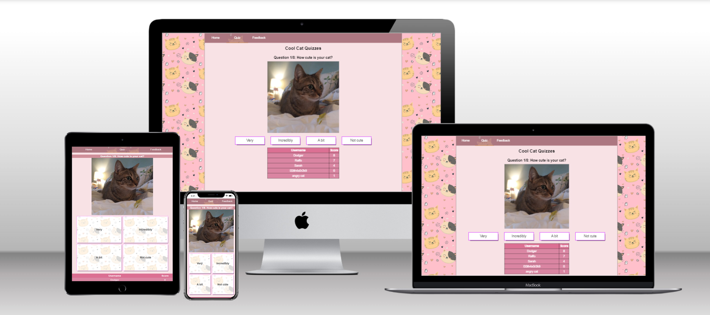

# Site Overview
The name of my Code Institute PP2 site is "Cool Cat Quizzes". It is a light-hearted website aimed at cat enthusiasts of all ages. I wanted to create a quiz based on the silly/unbelievable
behaviours of my own cats, which I have often also seen repeated by other people's cats in real life and on the Internet. I was also inspired by the types of quizzes you would find on Buzzfeed and warm nostalgia for the type of homebrew, popularly created quizzes which were prominent during my youth on sites such as Bebo. I thought it would be a fun project and also something that appeals commonly to young and old alike.

# Table of Contents
* [Technologies Used](#technologies-used)
* [Resources](#Resources)
* [User Stories](#user-stories) 
* [Overview](#Overview)
* [Technical Features](#technical-features)
* [Testing](#testing)
    * [Manual Testing](#manual-testing)
    * [Lighthouse Testing](#lighthouse)
    * [Validator Testing](#validator)
    * [Bugs](#bugs)  
* [Deployment](#deployment)
* [Credits](#credits)  

------

# Technologies Used
- [HTML5](https://en.wikipedia.org/wiki/HTML) for markup 
- [CSS3](https://en.wikipedia.org/wiki/CSS) for the stylesheet 
- [Github]( https://github.com/) for file management & version control 
- [Gitpod]( https://www.gitpod.io/) for code editing and pushing commits
- [Sublime Text](https://www.sublimetext.com/) as a backup editor whenever I felt the need for it.

# Resources
- [Code Institute](https://codeinstitute.net/) Course material & the Slack community 
- [W3Schools]( https://www.w3schools.com/) as reference material
- [Mozilla MDN](https://developer.mozilla.org/en-US/docs/Web) as further reference material on HTML/CSS
- [CSSTricks]( https://css-tricks.com/) for CSS tips and tricks
- [StackOverflow](https://stackoverflow.com/) I never get through any project without looking at StackOverflow at least once.
- [Am I Responsive](http://ami.responsivedesign.is/) – generate an image of the site on different sized screens
- [W3C Markup](https://validator.w3.org/) Validate HTML code
- [W3C CSS](https://jigsaw.w3.org/css-validator/) CSS Validation 
- [JSHint](https://jshint.com/) Javascript Validation

# User Stories

-   As a user I want to consume content about cats
-	As a user I want to be able to easily navigate through the site
-	As a user I want to not just read about cats; but see cute cats as well.
-	As a user I want to be able to get in touch with the owners of the site and suggest ideas for quizzes or enquire when they might put out more fun quizzes.
-	As a user I want the site to be easy to learn and intuitive; so that any repeat visit will not cause confusion.
-   As a user I want to test my knowledge on cats.

# Overview

This site contains 3 pages:
A Home page with a banner image, a brief overview of the site, the High Scores leaderboard, and a link to start the quiz.
A Quiz page which allows the user to run through the quiz and get their answers evaluated in the Results section of the quiz.
A Feedback page which allows the user to contact the website admin.

The design of each page has been kept clean and simple in a way that means users of any age can navigate through the site.
The goal of the site is to appeal to lovers of cats and cute things; whoever they might be.

## Technical Features

* Flexbox styling and media queries; complete continuity and preservation of features from Desktop to mobile, responsive design from 1920x1080 down to 616x800 in full desktop mode and support for practically any mobile device.

* Dynamic and lively interactable buttons/fields - all major user input features have dynamic elements on Desktop which make it obvious when you have hovered over them and obvious when you have clicked into them - e.g the colour of the navbar buttons changes when you mouse over them, and a background image and a little border line is applied to the bottom of the navbar button which corresponds to the page the user is currently on.

* Pseudo-static local leaderboard - when a username is submitted, the last username and score are saved to localStorage and remain there no matter how many times the page is refreshed or if another page is clicked into.

* Confirmation page upon submission of Contact form; validation of user-input (all boxes must be filled in before the form can be sent, input must match accepted patterns - no unreasonable special characters in names, no symbols other than @ or . in emails, checkbox must also be ticked before form can be submitted).

## Future Features
There are more features which I would have liked to add if I had the time, the proficiency, or if the scope called for them. 

* I would have liked to implement a more complex quiz with multiple choices and with each "answer" having multiple attributes which would all be stored in different integer variables, which would further diversify and multiply the amount and types of "results" which would be available to the user - at the start I wanted to but did not have much of a clue how to do this, but I would feel much more confident about it now if I started from scratch again - however, time is limited as I work a full-time job Monday-Friday, and every day is a learning day.

* I would have liked to implement even *several* different quizzes for the user to choose from. 

* I would have liked to implement a "toggle" to simplify the colours of the website, for accesibility purposes.

* If the scope called for it, I would have implemented a properly static leaderboard with an SQL database rather than a pseudo-static one that uses localStorage - however this would have earned me zero marks, meaning it would have been an unwise investment of my time. Currently, when another username/score is submitted, it briefly pops up next to the previous username, but then it overwrites it once the page is refreshed - I am not sure whether there is a way to dynamically create variables with incremented names - eg var usr1, var usr2, var usr3 - etc - which would allow for multiple pseudo-static local entries. A database (or even possibly a JSON file) is a better choice here.

# Design

Given that I was inspired by Buzzfeed and Bebo quizzes I took rough inspiration from both - images to accompany each question, cutesy/over the top styling.

I also had Kahoot! in my mind the whole time, but I could not think of its name until now. Quiz games have been quite "popular" amongst everyone in my generation (late 1990s) as far back as I can remember. I wanted to replicate that kind of simple fun - with a simple, unserious stylesheet to match.

As in the screenshot above - lots of shades of pink, cute smiling cats accompanied by hearts, and a UI which I believe is as simple and unambiguous as can be.

Where I have chosen white text, I have accompanied it by a darker shade of pink, where I have chosen black text, I have endeavoured to use a light shade of pink or even a white - it is my hope that this gives it sufficient contrast for accessibility. 

# Testing 

## Manual Testing

Manual testing was done on a self-built Desktop with an Intel Core i3-10105F, 24GB of DDR4 memory, a 250GB SSD and a GeForce GTX1650, running Google Chrome on Windows 10 Pro 21H2.

Feature Tested | Expected Result | Actual Result | Pass/Fail
---------------|-----------------|---------------|----------
Start Button | When clicked, should open the Quiz page the same as clicking "Quiz" in the Navbar should. | As expected | Pass
Quiz Buttons | When clicked, should a) verify whether the input matches the answer in the array, b) clear itself for the next set of answers, c) automatically load the next answers. When Question 8 receives an input, it should be verified and then the results function should run. | As expected | Pass
Results function | When executed, should a) calculate the score and display it on the page as a decimal and a percentage, b) give different "grade" texts and images based on how many answers were correct/incorrect, c) change the text of "Start Quiz" to "Restart Quiz" and turn it into a refresh button. | As expected | Pass
Submit Username/Score function | When 'Submit' is clicked, the function should a) verify the username according to regex and reject as needed, b) log the score to localStorage and display it on the table, c) maintain the entry on the table throughout any number of refreshes, page changes, etc. | As expected | Pass
Feedback form | When filled out, should validate user input according to regexp for personal names, emails, and whether the boxes are blank or not. | As expected | Pass
Send Feedback | When clicked, provided all the above conditions are true, should give a little alert popup to say "Message Sent! | As expected | Pass
Navbar buttons | When clicked, should bring you reliably to the other pages in the site, and update the relevant navbar button to have "active" type styling. | As expected | Pass
Cute Cat Pictures | Should bring joy to the heart, if you like cats. | As expected | Pass

## Browser Testing 
Browser Tested | Working Status
---------------|---------------
Chrome | Works as expected
Firefox | Works as expected
Microsoft Edge | Works as expected

## Device Testing
Device Tested | Working Status
--------------|---------------
Xiaomi Redmi Note 8 | Works as expected
Dell Latitude E5470 | Works as expected

## Lighthouse

I ran the website through Chrome's Lighthouse.

I ran Lighthouse tests at several points throughout the project, but these above are the final scores.

Learning from last time; I pre-converted most of the major images to Webp format - I had had bad experiences converting the background image to webp also, so I left this alone.

My accessibility score was impacted on Feedback for the presence of 200KB worth of data - personally I do not think this merits that much of a downgrade in score nor accessibility.

# Bugs

* I utilized the "problems" tab on Gitpod to monitor any syntax issues.

* I utilized Chrome's developer tools for HTML/CSS/JS debugging and real-time modification.

* Where I did not have the relevant device for testing, I utilized Chrome's developer tools to simulate various mobile/touchscreen devices. This revealed many styling issues which necessitated writing rules for smaller screens, narrower screens, higher-resolution touchscreens, etc.

* I utilized console.log to test whether codeblocks were being ran correctly.

* In the early stages, I got many instances of "Uncaught TypeError: Cannot set properties of null (setting 'innerHTML')" and after some research on StackOverflow and reading back through my code carefully, realized I had a) made typos, b) neglected to create valid IDs for "documentGetElementByID" or had used "class" instead of "id" in my HTML.

* I ran each individual page of the website through W3C Markup & CSS validator & JSHint to get a "second opinion" and fixed my code accordingly. I had quite a few missed semicolons, trailing slashes, missing "alt" texts etc.

* In the course of testing and reviewing my code, in regards to smaller Desktop screens, I realized it made more sense to keep the "width" of the "section" in separate media queries
according to the screen size, and keep the rest of the desktop styling global. I tried to reduce redunancy in my styling and compounded distinct CSS rules for similar elements into one all-encompassing rule where possible.

* I fixed many visual issues caused by "display:block" by migrating them to "display:flex".

* I identified potential security holes in the Javascript code for the leaderboard and rectified it - beforehand, the box allowed unlimited characters of any type - although not directly relevant as it concerns SQL databases, this light-hearted comic from XKCD always sticks in my mind:

## Known Issues

* If a user clicks through the questions by "spamming" the mouse button, the following error is produced. 

    `"Uncaught TypeError: Cannot read properties of undefined (reading 'question')
    at showNext (cats.js:100:75)
    at next (cats.js:127:7)"`

* Regardless, this does not affect functionality and everything runs as intended even with the error in the console. 
    
  

# Deployment
I deployed my site, "Cool Cat Quizzes" on Github Pages. The process was as follows: 

- I went to the project repository and navigated to the 'Settings' tab on the furthest right-edge of the repository menu
- I selected 'Pages' midway down the left-hand menu under the 'Code and automation' section
- Under Branch, I selected 'Main' and then hit save.
- I went off and retrieved a snack, came back and refreshed the page, and now had a link to my live website.

The live website can be found here: https://jakob-bren.github.io/my-full-template/index.html 

## How to Fork
1. Login/signup to [GitHub](https://github.com/).
2. Locate my repository - in this case [jakob-bren/pp2-coolcats](https://github.com/jakob-bren/pp2-coolcats)
3. Click on the 'Fork' button in the upper right.
4. A forked version of my repoitory will appear in your own list of repositories.

# Credits

* I referenced this [tutorial](https://gamedevacademy.org/javascript-quiz-tutorial/) for inspiration on how a quiz might look in Javascript.

* I also referenced a lot of disparate StackOverflow articles for explanation of how to create individual codeblocks to perform xyz function, such as [this](https://stackoverflow.com/questions/30922008/calculate-percentage-javascript) for the mathematical logic on how to calculate a percentage , or [this](https://stackoverflow.com/questions/26904763/making-a-quiz-with-javascript-getting-array-values-from-and-object) which is quite similar to the GameDevAcademy tutorial above and helped solidify my comprehension of the code I was writing.

* The pictures of the tabby cat and the tuxedo cat are all taken by either myself or my wife.

